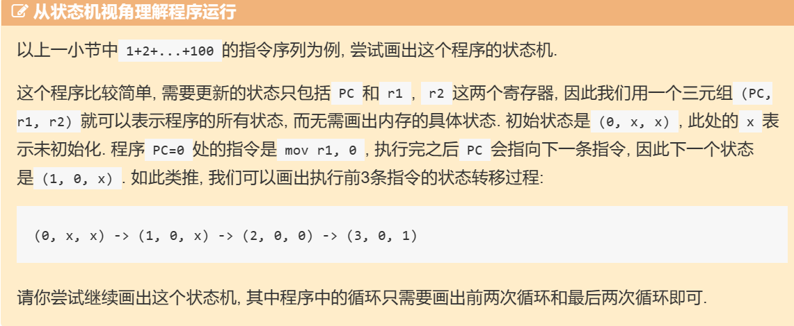

# 从1开始的PA之旅

为什么是从1开始呢，因为PA 0已经大概做完了。

P.S：事后看起来其实可能PA 0里面没有完成的还很多

## 在开始愉快的PA之旅之前

### NEMU是什么？


## 开天辟地的篇章

### 最简单的计算机
计算机做的无非就是下面这件事：

```cpp
while (1) {
  从PC指示的存储器位置取出指令;
  执行指令;
  更新PC;
}
这样, 我们就有了一个足够简单的计算机了. 我们只要将一段指令序列放置在存储器中, 然后让PC指向第一条指令, 计算机就会自动执行这一段指令序列, 永不停止.   
```

#### 从状态机视角理解程序运行

```
// PC: instruction    | // label: statement
0: mov  r1, 0         |  pc0: r1 = 0;
1: mov  r2, 0         |  pc1: r2 = 0;
2: addi r2, r2, 1     |  pc2: r2 = r2 + 1;
3: add  r1, r1, r2    |  pc3: r1 = r1 + r2;
4: blt  r2, 100, 2    |  pc4: if (r2 < 100) goto pc2;   // branch if less than
5: jmp 5              |  pc5: goto pc5;
```

**注意**：blt语句并不是无条件PC+4



(0,x,x)->(1,0,x)->(2,0,0)->(3,0,1)->(4,1,1)->(3,1,1)->(2,1,1)->(3,1,2)->(4,3,2)->(2,3,2)->...->(4,5050,100)->(5,5050,100)->...


## RTFSC（Read the Fine Source Code）

### 配置系统和项目构建


nemu的main函数：

``` c
  int main(int argc, char *argv[]) {
    /* Initialize the monitor. */
  #ifdef CONFIG_TARGET_AM
    am_init_monitor();
  #else
    init_monitor(argc, argv);
  #endif
  
    /* Start engine. */
    engine_start();
  
    return is_exit_status_bad();
  }
~                             
```

转到```engine_start```函数的定义

``` c
void engine_start() {
#ifdef CONFIG_TARGET_AM
  cpu_exec(-1);
#else
  /* Receive commands from user. */
  sdb_mainloop();
#endif
}
```

```cpu_exec```函数

``` c
void cpu_exec(uint64_t n) {
  g_print_step = (n < MAX_INST_TO_PRINT);
  switch (nemu_state.state) {
    case NEMU_END: case NEMU_ABORT: case NEMU_QUIT:
      printf("Program execution has ended. To restart the program, exit NEMU and run again.\n");
      return;
    default: nemu_state.state = NEMU_RUNNING;
  }

  uint64_t timer_start = get_time();

  execute(n);

  uint64_t timer_end = get_time();
  g_timer += timer_end - timer_start;

  switch (nemu_state.state) {
    case NEMU_RUNNING: nemu_state.state = NEMU_STOP; break;

    case NEMU_END: case NEMU_ABORT:
      Log("nemu: %s at pc = " FMT_WORD,
          (nemu_state.state == NEMU_ABORT ? ANSI_FMT("ABORT", ANSI_FG_RED) :
           (nemu_state.halt_ret == 0 ? ANSI_FMT("HIT GOOD TRAP", ANSI_FG_GREEN) :
            ANSI_FMT("HIT BAD TRAP", ANSI_FG_RED))),
          nemu_state.halt_pc);
      // fall through
    case NEMU_QUIT: statistic();
  }
}
```

此时此刻笔者已经受不了手动查找定义了，于是安装了ctags。ctags的安装命令：

``` bash
sudo apt-get install exuberant-ctags
```
进行一系列安装操作（主要是修改.vimrc）之后，就可以使用ctrl-]来查找定义了

tmux的ctrl+b是先按，不是和后面的字母一起按。


### 就是这么简单
第一次看这一部分的时候觉得没什么用，扫了一眼就过了，但是看到下一章的时候发现完全看不懂，遂回到这里。  
正如最下方写的，这一章已经包含了组成一台计算机所需要的所有东西。

#### 存储器
存储器是个在nemu/src/memory/paddr.c中定义的大数组。这里同样定义了访存相关的一些接口。

#### 寄存器
PC和通用寄存器都在nemu/src/isa/$ISA/include/isa-def.h中的结构体中定义。这个定义对后面输出寄存器内容很重要。

#### TRM
TRM的工作方式通过cpu_exec()和exec_once()体现。单步执行依赖于这里。

## 基础设施
本章要求给sdb(simple debugger)增加几个功能。这里最重要的其实还是RTFSC。这样才能理解代码框架，知道要实现某个功能需要从哪里调用API。  

### 解析命令
主要利用strtok函数，来根据空格拆分参数表。

### 单步执行
cpu_exec()即可。

### 打印寄存器

需要知道寄存器的定义在哪里，参见上一章。

### 扫描内存

参见│ ~/ics2024/nemu/src/memory/paddr.c


## 表达式求值